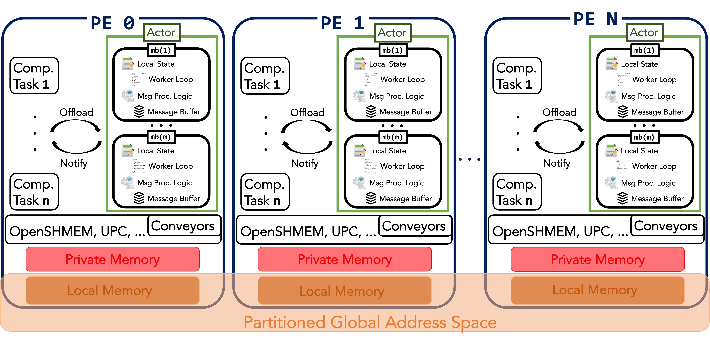

## What is the Actor model?
 
The actor model is a message-based concurrency model. In the world of the actor model, you can imagine that multiple actors are concurrently running and communicating each other via message-passing. 

<figure markdown>
  { width="550" }
  <figcaption>The Actor Model</figcaption>
</figure>

An actor has 1) an immutable identity, 2) encapsulated mutable local state , 3) procedures to manipulate the local state, and 4) logical thread of control. An actor may 1) send messages to other actors, 2) process received messages one-by-one, 3) change local state, and 4) even create new actors.

## What are typical API routines in the Actor model?

- `new`: create an actor.
- `start()`: let the actor start sending and receiving messages.
- `exit()`: terminate the actor.
- `send()`: send a message to another actor.
- `process()`: process a received message from another actor.

## Reference

- "COMP 322: Fundamentals of Parallel Programming Lecture 21: Actors" by Prof. Vivek Sarkar.
