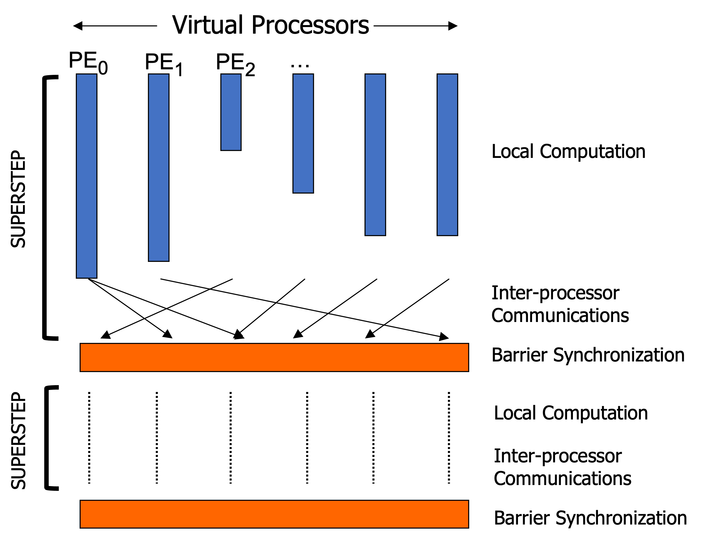

## What is the bulk synchronous parallel model?

The Bulk Synchronous Parallel (BSP) model is one of the most popular parallel computation models. 

The model consists of:

- A set of processor-memory pairs.
- A communication network that delivers messages in a point-to-point manner.
- Efficient barrier synchronization for all or a subset of the processes.


<figure markdown>
  { width="450" }
  <figcaption>The BSP Model</figcaption>
</figure>

The horizontal structure of the BSP model indicates a set of computation can be distributed across a fixed number of virtual processors.

The vertical structure can be viewed as a sequence of "supersteps" separated by barriers, in which each processor performs local computation and (a)synchronous communications in a superstep, and the role of the barrier is to ensure that all communications in a superstep have been completed before moving to the next superstep.

## Single Program Multiple Data (SPMD) Programming

One realization of the BSP model on the software side is the SPMD-style programming. In SPMD, virtual processors execute the same program independently, which is a good fit not only for realizing the BSP model, but also for writing a distributed program for large-scale systems in a scalable way. 

The example code below shows a basic structure of a BSP program written by the SPMD-style (OpenSHMEM/MPI):

=== "OpenSHMEM"

    ```
    #include <shmem.h>
    // the main function is executed by multiple PEs
    int main(void) {
      shmem_init();
      int npes = shmem_n_pes(); // get the number of the PEs
      int mype = shmem_my_pe(); // get my PE ID
      // superstep
      {
        ...  // local computation
        ...  // communication
        shmem_barrier(); // barrier
      }
      ...
      shmem_finalize();
    }
    ```

=== "MPI"

    ```
    #include <mpi.h>
    // the main function is executed by multiple PEs
    int main(void) {
      MPI_Init(NULL, NULL);
      int myRank, nRanks;
      MPI_Comm_size(MPI_COMM_WORLD, &nRanks); // get the number of the ranks
      MPI_Comm_rank(MPI_COMM_WORLD, &myRank); // get my rank ID
      // superstep
      {
        ...  // local computation
        ...  // communication
        MPI_Barrier(); // barrier
      }
      ...
      MPI_Finalize();
    }
    ```    
    
## Further Readings

- Leslie G. Valiant. 1990. A bridging model for parallel computation. Commun. ACM 33, 8 (Aug. 1990), 103–111. <https://doi.org/10.1145/79173.79181>
