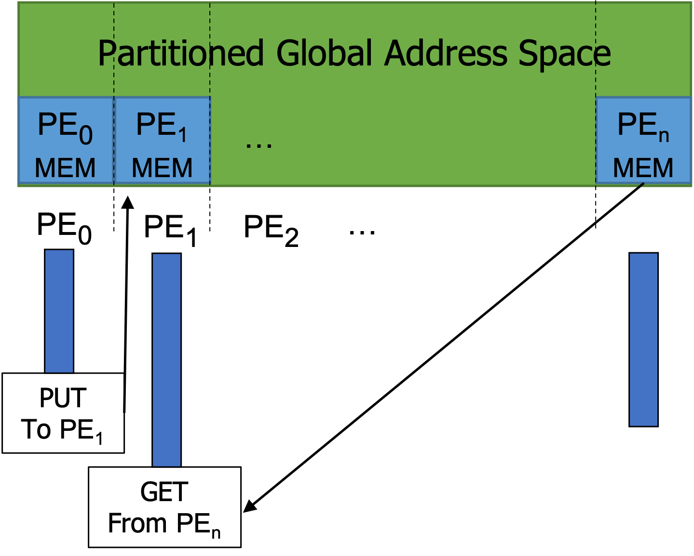

## What is Partitioned Global Address Space (PGAS)?

The PGAS (pronounced p-gas) is a programming model which gives the user the illusion of shared memory on distributed systems. As the name implies, you can imagine that there is a single shared global address space consisting of logical portions, each portion of which is local to each processing element (PE). Typically, many PGAS languages/libraries offer point-to-point one-sided communication, where the user can use 1) `put` routine to write data to a remote (non-local) location, 2) `get` routine to read data from a remote location, whereas MPI requires two-sided communication.

<figure markdown>
  { width="450" }
  <figcaption>The PGAS Model</figcaption>
</figure>

!!! note
 
    While recent versions of MPI supports one-sided communications, that is not as simple as what PGAS languages/libraries offer.

## Examples of PGAS languages/libraries

- X10
- Chapel
- Unified Parallel C (UPC)
- Co-Array Fortran (CAF)
- OpenSHMEM
