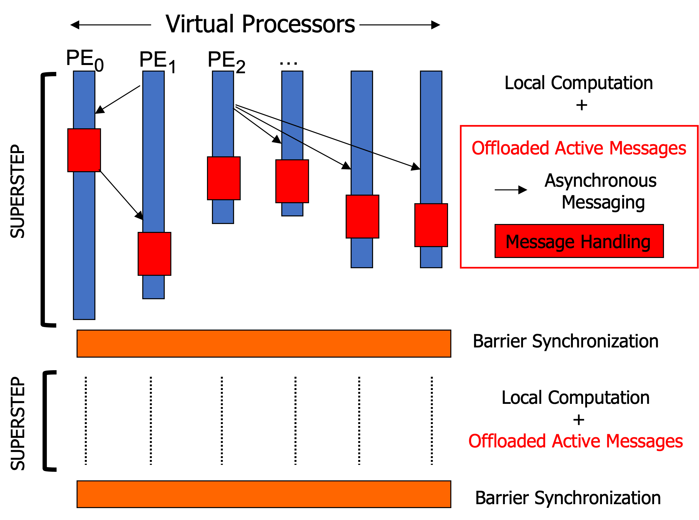

<figure markdown>
  { width="450" }
  <figcaption>The FA-BSP Model</figcaption>
</figure>

The Fine-grained Asynchronous Bulk Synchronous Parallel (FA-BSP) model is an extended version of [the BSP model](https://hclib-actor.com/background/bsp/) that facilitates fine-grained asynchronous point-to-point messaging even during the local computation. As illustrated in the figure above, each processing element (PE) performs 1) a local computation (the blue part), 2) asynchronous messaging (the arrows), and 3) message handlers (the red part) in an interleaved fashion. We employ [the actor model](https://hclib-actor.com/background/actor/) as a user-facing programming model to write a superstep as it inherently supports asynchronous messaging and message handling. 

One motivating example is the vertex-centric graph programming model. Specifically, in each superstep, each vertex asynchronously communicates to its neighbors over the edges via actor messaging:

``` c title="vertex centric programming with the FA-BSP model (PSEUDO CODE!)" linenums="1"
// SPMD Execution (Each PE executes the same code)
// superstep (User Code: local computation part)
{
    // for each vertex that belongs to the current PE
    for (v: pe_local_vertices) {
      // for each neighbor of the current vertex
      for (neighbor: v.neighbors()) {
        // asynchronously send a message to the neighbor
        send(...); 
      }
    }
    // barrier and/or collective
}
...
// User Code: Actor Definition
class MyActor {
   ...
   // The FA-BSP runtime calls this user-defined process function at a well-defined point
   process(...) {
     // process one message
   }
};
```

Here, in a superstep, each PE iterates over its local vertices' neighbors and sends a message to a specific neighbor with the `send()` API. The runtime switches back and forth between the superstep, message handler, and internal communication to overlap computation and communication.

The FA-BSP model typically provides excellent scalability and performance and outperforms state-of-the-art BSP implementations in [various large-scale graph applications](https://hclib-actor.com/#applications).
