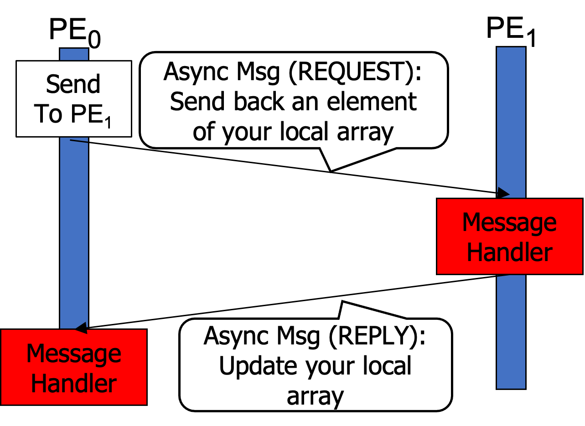

## Summary

In the remote GET pattern, there are two communications: 1) a PE requests a remote PE to send back its local data (REQUEST), and 2) the receiver actually sends back data to the requester (REPLY). Since this GET communication is asynchronous, when the requester creates an asynchronous message, it also specifies where to store received data so the receiver can know the destination location in the requester's memory. 

The figure below illustrates the GET pattern. While the figure only shows one PE0 -> PE1 -> PE0 communication for presentation purposes, in reality, each PE does the sender's and receiver's role in an interleaved fashion.

<figure markdown>
  { width="300" }
  <figcaption>The GET Pattern</figcaption>
</figure>

## Code Example

Actor class definition:

``` c++ linenums="1"
// packet
struct IgPkt {
    int64_t dst;
    int64_t src;
};

enum MailBoxType{REQUEST, REPLY};

class IgSelector: public hclib::Selector<2, IgPkt> {
  //shared table array src, target
  int64_t * ltable, *tgt;

  void req_process(IgPkt pkt, int sender_rank) {
      pkt.src = ltable[pkt.src];
      // Reply back to the requester
      send(REPLY, pkt, sender_rank);
  }

  void resp_process(IgPkt pkt, int sender_rank) {
      tgt[pkt.dst] = pkt.src;
  }

  public:

    IgSelector(int64_t *ltable, int64_t *tgt) : ltable(ltable), tgt(tgt){
        mb[REQUEST].process = [this](IgPkt pkt, int sender_rank) { this->req_process(pkt, sender_rank); };
        mb[REPLY].process = [this](IgPkt pkt, int sender_rank) { this->resp_process(pkt, sender_rank); };
    }

};
```

Main program:

``` c++ linenums="1"
IgSelector* actor_ptr = new IgSelector(larray1, larray2);
hclib::finish([=]() {
  actor_ptr->start();
  for (int i = 0; i < N; i++) {
    IgPkt pkt;
    pkt.dst = i;
    pkt.src = i;
    int pe = (shmem_my_pe() + 1) % shmem_n_pes();
    printf("[PE%d MAIN] request PE%d to send ltable[%d]\n", shmem_my_pe(), pe, i);
    actor_ptr->send(pkt, pe);
  }
  actor_ptr->done(REQUEST);
});
```
