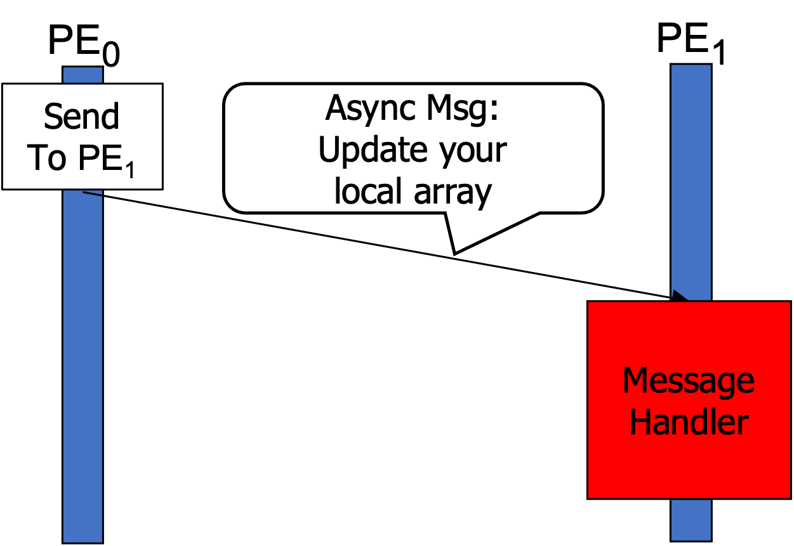

## Summary
In the remote PUT pattern, a PE requests a remote PE to update its local data. On the sender side, it keeps sending a massive number of requests to remote locations and invokes the `done()` API when it will not send any more messages. On the receiver side, the received messages are processed by a message handler one-by-one. 

One benefit of this communication model is that it does not require remote atomics (e.g., `shmem_atomic_add()`) due to the sequential processing of messages. 

The figure below illustrates the PUT pattern. While the figure only shows one PE0 to PE1 communication for presentation purposees, in reality, each PE does the sender's and receiver's role in an interleaved fashion.

<figure markdown>
  { width="300" }
  <figcaption>The PUT Pattern</figcaption>
</figure>


## Code Example

Actor class definition:

``` c++ linenums="1"
// Actor Class
class MyActor: public hclib::Selector<1, int> {
    int *larray;
    // Message Handler
    void process(int idx, int sender_rank) {
        larray[idx] += 1;
    }
public:
    MyActor(int *larray) : larray(larray) {
        mb[0].process = [this](int idx, int sender_rank) { this->process(idx, sender_rank);};
    }
};
```

Main program:

``` c++ linenums="1"
// Main Program
MyActor* actor_ptr = new MyActor(larray);
hclib::finish([=]() {
    actor_ptr->start();
    for (int i = 0; i < N; i++) {
        int pe = (shmem_my_pe() + 1) % shmem_n_pes();
        // SEND
        actor_ptr->send(i, pe);
    }
    actor_ptr->done(0);
});
```
